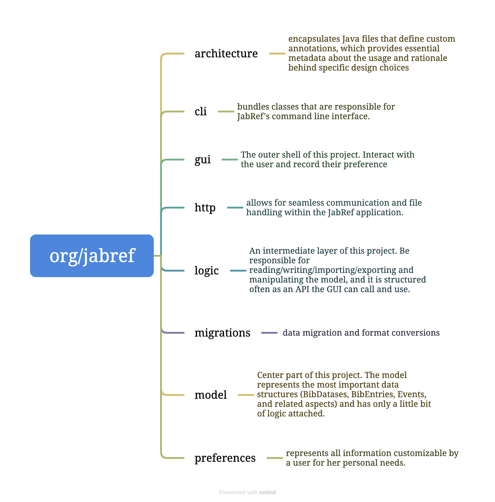

## Project

Name: JabRef

URL: https://github.com/JabRef/jabref

A reference management tool allowing users to collect, organize, and search for bibliographic information. 

## Onboarding experience

Did you choose a new project or continue on the previous one?

We selected a new project because our previous one, Apache Commons Lang, did not have as many appropriate issues available for us to work on.

If you changed the project, how did your experience differ from before?

One difference was that JabRef uses Gradle to build while Apache Commons Lang uses Maven, but this switch was fairly smooth. JabRef provided detailed instructions for how to set up a local workspace, particularly in IntelliJ, which was very helpful.

## Effort spent

For each team member, how much time was spent in

1. discussions/meetings;

- Meeting 1: initial discussion to look for projects and issues (45m)
- Meeting 2: finalizing project and issue choice (30m)
- Meeting 3: discussing chosen issue and preparing to start work (60m)
- Meeting 4: creating work plan and delegating tasks (30m)
- Meeting 5: check-in on progress and delegating next tasks (15m)
- Meeting 6: check-in on progress and discussing final steps to complete requirement 1 (30m)
- Meeting 7: discuss and delegate final tasks (45m)
- Meeting 8: check-in on final tasks (30m)
- Meeting 9: wrapping up

2. discussions within parts of the group;

Anna

Emil

Filippa

Lotta

Tianning

3. reading documentation;

Anna

Emil

Filippa

Lotta

Tianning

4. configuration and setup;

Anna

Emil

Filippa

Lotta

Tianning

5. analyzing code/output;

Anna

Emil

Filippa

Lotta

Tianning

6. writing documentation;

Anna

Emil

Filippa

Lotta

Tianning

7. writing code;

Anna

Emil

Filippa

Lotta

Tianning

8. running code?

Anna

Emil

Filippa

Lotta

Tianning

9. in total?

Anna

Emil

Filippa

Lotta

Tianning

## Overview of issue(s) and work done.

Title: Import bib files from BibDesk and parse the groups + linked files

URL: https://github.com/JabRef/jabref/issues/10381

Add support for importing reference libraries from BibDesk, another reference management tool, to JabRef. In particular, make BibDesk groups available in the JabRef library and decode/translate BibDesk-specific fields.

Scope (functionality and code affected).

The main class affected by the changes is the `BibtexParser` class. 
For parsing groups, an additional case is added to the `parseJabRefComment` function to detect BibDesk comments. New functions `parseBibDeskComment` and `addBibDeskGroupEntriesToJabRefGroups` are added to parse these comments and create the JabRef groups.
For decoding linked files ... **TODO** 

## Requirements for the new feature or requirements affected by functionality being refactored

1. Import BibDesk Static Groups to JabRef

A BibDesk Static Group groups an arbitrary set of references in a reference library. The group information is stored as metadata in a comment field in the library bibliography file and entries in the group are identified by a list of citation keys in the comment. JabRef should support the import of such groups. For every BibDesk Static Group specified in the library bibliography file, the JabRef importer should create an equivalent JabRef Explicit Group containing the specified entries. It should make these groups available in the JabRef library.

2. Import BibDesk Smart Groups to JabRef

A BibDesk Smart Group groups references in a library based on specified criteria in one or several of the reference fields. The group information is stored as metadata in a comment field in the library bibliography file. Unlike a BibDesk Static group, the entries in the group are not explicitly listed. Rather, the group is identified by a set of criteria. JabRef does not have an equivalent dynamic group type, but it should still support the import of such BibDesk groups by creating explicit groups with the appropriate references. For every BibDesk Smart Group specified in the library bibliography file, the JabRef importer should use the criteria to identify which references in the library should belong to the group and create a JabRef Explicit Group with these entries. It should make these groups available in the JabRef library.

3. Import Multiple BibDesk Group Types to JabRef

A BibDesk library may contain several groups of different types. Information about the groups is contained in a comment for each type (Static or Smart). That is, there may be multiple groups of the same type in one comment but if the BibDesk library contains both Static and Smart groups, there will be two separate comments. The JabRef importer should be able to import all groups in such libraries and make them available in the JabRef library. In particular, it should only create one group tree even if bibliography file contains multiple group comments.

4. Convert BibDesk Linked Files to Proper Format

BibDesk stores linked files in reference fields called `bdsk-file-x`. The field includes a base64-encoded binary plist containing the relative path and metadata that macOS uses to keep track of a file in case it is moved. The JabRef importer should decode such fields and translate the field name and contents according to the conventions of the corresponding JabRef field `file`.

Optional (point 3): trace tests to requirements.

1. `BibtexParserTest:integrationTestBibDeskStaticGroup` traces to requirement 1 (Import BibDesk Static Groups to JabRef)
2. `BibtexParserTest:integrationTestBibDeskSmartGroup` traces to requirement 2 (Import BibDesk Smart Groups to JabRef)
3. `BibtexParserTest:integrationTestBibDeskMultipleGroup` traces to requirement 3 (Import Multiple BibDesk Group Types to JabRef)
4. `BibtexParserTest:...` traces to requirement 4 (Convert BibDesk Linked Files to Proper Format)

## Code changes

### Patch

`git diff main bibDeskImport`

Optional (point 4): the patch is clean.

## Test results

Overall results with link to a copy or excerpt of the logs (before/after
refactoring).

**TODO**

## UML class diagram and its description

### Key changes/classes affected

Optional (point 1): Architectural overview.
#### Purpose

JabRef is an open-source reference manager designed for managing and organizing bibliographic databases.

It provides three main functions to effectively manage the references:

1. import/export

JabRef streamlines reference management with over 15 supported formats for easy import, efficient retrieval of full-text articles, and seamless extraction of metadata from PDFs. The one-click browser extension simplifies new reference imports. JabRef also excels in sharing, offering multiple export options, including a library saved in a text file format. This format ensures convenient sharing via Dropbox and compatibility with version control.

2. generate citation

JabRef simplifies citation generation with native BibTeX and Biblatex support, cite-as-you-write functionality in various external applications, and the flexibility to format references using built-in styles or create custom ones. Seamless integration with Word and LibreOffice/OpenOffice facilitates easy citation insertion and formatting.

3. organize

JabRef offers comprehensive research organization tools, including hierarchical collections, keyword tagging, and manual assignments. Its advanced search, bibliographic data correction, and customizable features streamline research management. Users can customize citation keys, metadata fields, and reference types, find and merge duplicates, and attach diverse documents. Automated rules for renaming and moving files enhance efficiency. JabRef also supports tracking reading progress with features like ranking, priority, and quality assurance.

#### Architecture

The Jabref main page consists of multiple folders and documents, with the code located in the src folder. This is the organization of the src folder.

In addition, particular function implementations can be found in the [java.org/jabref](http://java.org/jabref) section located under the main folder. Here is its structure:

For each layer, JabRef forms packages according to their responsibility, i.e., vertical structuring. The model should have no dependencies on other classes of JabRef and the logic should only depend on model classes.

## Overall experience

What are your main take-aways from this project? What did you learn?

In this project we have learned a lot about how open-source contribution works in practice and how much goes into issue resolution besides writing the code itself. For example, understanding the issue (in our case a requested feature) and formulating good requirements from its description as well as reading documentation and understanding the architecture, purpose, and functionality of the overall system are also important parts of the process.

How did you grow as a team, using the Essence standard to evaluate yourself?

According to the Essence standard checklist our way of working has progressed from In Place to next state Working Well since the previous assignment. To complete this issue resolution task, we for example got to practice using and adapting our way-of-working to suit the current context since the nature of the assignment was quite different from the previous ones. We have well-established practices such as using our issue tracker and pull requests on Github as well as for communicating and supporting each other with our tasks. We also continually tune our use of practices and tools. In this assignment, for example, we switched from Maven to Gradle for building and testing.

Optional (point 6): How would you put your work in context with best software engineering practice?

The benefits, drawbacks, and limitations of our work can be discussed in terms of the SEMAT (Software Engineering Method and Theory) kernel alphas, activity spaces, and competencies in each of the three areas of concern (Customer, Solution, Endeavor). The kernel provides a common ground for best software engineering practices.

**Customer**
- Alphas: opportunity, stakeholder
- Activity spaces: explore possibilities, understand stakeholder needs, ensure stakeholder satisfaction, use system
- Competencies: stakeholder representation

The _opportunity_ and _stakeholder_ needs for our work were presented in the form of a Github issue on the project repository, which expressed a desire for a new feature for the system.
Focusing on the activity spaces _exploring possibilities_ and _understanding stakeholder needs_ played an important role, particularly in the early stages of our work, and helped put us on the right track for planning and carrying out the work itself.
A limitation of our work is that it is somewhat lacking in _stakeholder representation_ since the only communication with the stakeholder was through the language of the initial issue. Having more communication would have helped with _ensuring stakeholder satisfaction_ and sorting out vagueness and underspecification regarding certain details in the request.

**Solution**
- Alphas: requirements, software system
- Activity spaces: understand requirements, shape system, implement system, test system, deploy system, operate system
- Competencies: analysis, development, testing

Our work in the _Solution_ area of concern greatly benefitted from following the SEMAT practice. We spent a lot of time in the beginning _understanding the requirements_. This involved figuring out more concretely what was needed of the _software system_ to satisfy the _opportunity_ and _stakeholders_.
For example, the issue only asked to be able to import BibDesk groups to JabRef, but there are many types of groups in BibDesk and we found that not all were relevant for this problem. 
Taking the time to do this allowed for a significantly smoother and more effective process in the later stages of _shaping_, _implementing_, and _testing_ the system.
Unfortunately, we ran out of time to finish developing the system according to all the requirements and therefore did not get the chance to _test_ the full system or _deploy_ it.
Also, due to the lack of further communication with stakeholders beyond the original issue, we cannot be sure if our full set of _requirements_ accurately represent the needs and if the resulting _implementation_ would fully solve the customer problem.

**Endeavor**
- Alphas: work, team, way of working
- Activity spaces: prepare to do work, coordinate activity, support team, track progress, stop work
- Competencies: leadership, management

The alphas, activity spaces, and competencies in the _Endeavor_ area of concern have played a useful role in our work throughout all the assignments in this course.
In this assignment, the nature of the task made the activity spaces _preparing to do the work_, _coordinate activity_, _support team_, and _track progress_ particularly valuable for creating an efficient workflow.
We had many meetings throughout to decide how to divide the work and delegate smaller subtasks as well as for progress check-ins. We also have designated Discord channels for assignment help, links and resources, et cetera which has helped us with communication.
The benefits of working in this way have been numerous. For example, it has ensured that everyone can make meaningful contributions both through working on tasks individually and being able to give and receive support to/from other group members. It has also helped us troubleshoot and work through obstacles more efficiently.
